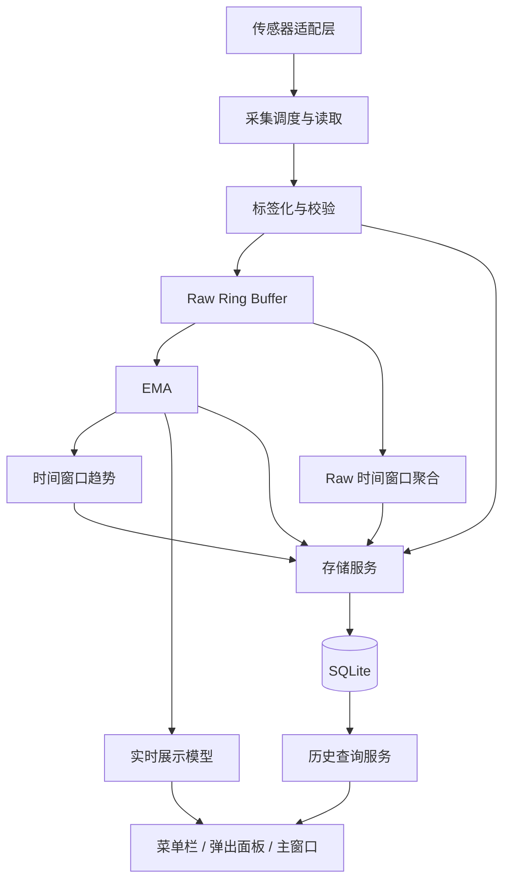

# 总体架构初步方案

更新日期：2026-09-14。状态：**推荐方案，未实施**。业务边界以 [需求规格](01-requirements.md) 为准。

## 架构选择

采用模块化单体：运行时一个本地原生应用进程，内部按明确接口划分构件。界面层使用 MVVM；MVVM 不代表整个应用的系统架构。SQLite 是应用内嵌数据库。

首个验证工具可以是独立命令行目标，其用途是验证和采集证据，不代表最终产品需要常驻命令行子进程。是否增加采集辅助进程／XPC，要根据权限、同步调用阻塞和崩溃测试结果决定，登记为 OQ-09。

## 逻辑数据路径

以下图采用 C03/C04 中的修正建议：Raw 历史聚合与 EMA 实时展示分路。OQ-04 的教学数据库往返要求仍需确认。

采集得到的 Raw 与加工结果均入库。实时视图读取加工后的内存数据，历史查询由存储服务完成。若最终确认实时折线必须读取 `ema_samples` 表，则通过查询服务实现，禁止界面直接管理 SQLite 连接。该数据承载位置争议见 OQ-04。

## 模块边界

| 模块 | 职责 | 不承担的职责 |
|---|---|---|
| SensorAdapter | 枚举、读取、解码、报告接口能力 | 业务聚合、UI、数据库 |
| SamplingService | 不同周期调度、重试协同、实际时间戳 | 直接绘图 |
| Processing | 校验、EMA、Raw 聚合、趋势、缺口处理 | 硬件接口细节 |
| Storage | 批量事务、查询、TTL、数据库会话 | 原生视图管理 |
| Presentation | 展示模型、状态和用户操作 | 直接读取 SMC 或打开数据库 |
| Diagnostics | 统一错误、独立日志、错误报告 | 自动上传故障材料 |
| AppLifecycle | 启动、会话、休眠恢复、停止 | 算法内部实现 |

## 并发与资源

- 采样、加工、存储、绘图分别调度；高频采样不要求全界面同频刷新。
- 硬件同步读取和 SQLite 写入放在专用后台执行环境，不占用主线程。
- 每个传感器或接口连接的并发策略由实测确定；建议同一读取通道避免重叠任务。
- 生产者与消费者间使用有界缓冲；容量、满队列策略、最大写入延迟见 OQ-10，不默认丢弃已承诺入库的样本。
- UI 仅接收所需快照及图表范围，避免不断累积完整历史副本。
- Swift 的 actor 可隔离可变状态，但不能自动中断底层阻塞调用；超时与取消机制需单独验证。

## 可替换与可测试性

硬件读取通过统一接口接入。测试中注入固定序列、错误序列、间歇缺口和模拟时钟；不要求 CI 拥有真实温度传感器。机型适配变化优先限制在传感器描述和适配层。

CPU Package 若采用聚合计算，应成为带来源和计算规则的派生指标，与物理传感器分开标记，详见 [采集设计](03-sensor-acquisition.md)。

## 架构实施前提

首台 M4 Air 的指标能力、普通用户权限、实际读取耗时和生命周期测试完成后，再冻结采集路径和进程结构。没有这些证据，不能宣称总体设计已满足全部硬件需求。

来源：C01、C03、C04；细化补充属于推荐设计。[来源](18-sources.md)
