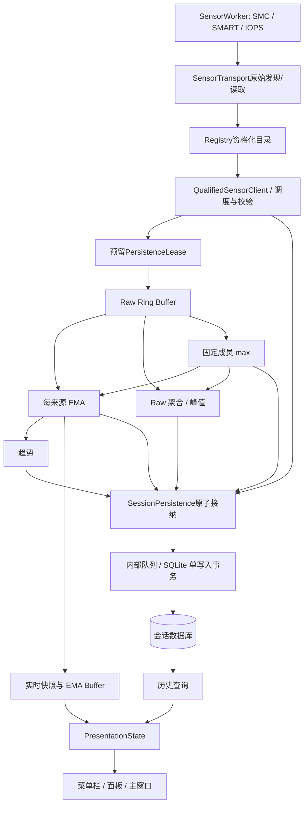

# 总体架构与运行时边界

更新：2026-09-21；contract revision 2，尚未实现生产App。参数与类型以[契约](21-implementation-contracts.md)为准。

## 确定的结构

Swift模块化单体，SwiftUI＋AppKit界面，SQLite嵌入式数据库。主App拥有调度、加工、存储与UI；**一个普通用户权限的自有SensorWorker子进程**拥有同步硬件句柄。它随App启动/结束，不是root服务、登录项或第三方CLI。分进程是为了避免同步驱动调用卡住界面，不改变本地部署边界。

选择依据：原型与macmon证明只读SMC/HID桥接路线；MacFanControl仅参考分层思想；进程隔离属于本项目工程设计，使用系统[Foundation Process](https://developer.apple.com/documentation/foundation/process)，不能说开源项目已经实现了本产品完整架构。

## 唯一数据路径

C11用户明确课程不强制数据库往返，采用优化方案：

Raw与EMA都持久化，保留各5分钟。菜单栏、数字、柱图和最近5分钟曲线使用内存EMA；1h/24h/72h历史读SQLite。视图不访问驱动或SQLite连接。实时值可能比已提交历史新至一个批量写入周期；数据库故障时明确显示暂未写入状态并停止新采集，不能把实时显示冒充已经持久化。

## 模块与所属执行环境

| 构件 | 所属环境 | 核心职责 |
|---|---|---|
| SensorWorker | 子进程串行命令循环 | 打开/枚举/读取/关闭；只发送读数和能力；不做EMA/数据库 |
| WorkerClient: SensorTransport | 主进程专用IO队列＋actor状态 | 有界原始协议、请求截止时间、generation和回收；不赋予传感器语义 |
| Registry／QualifiedSensorClient | SensorRuntime actor | 将底层事实资格化为QualifiedSourceCatalog；映射SourceID与本代handle |
| MetricResolver | MonitorEngine actor | 固定定义、CPU派生；只消费合格来源，不猜物理核 |
| SamplingService | MonitorEngine actor＋SystemClock | CPU/SSD/Battery日程、重试、背压预留 |
| ProcessingEngine | 同一个MonitorEngine actor，注入SessionPersistence提交能力 | 顺序推进Raw/EMA/聚合/趋势/缺口；commit确认后换状态并返回ProcessingReceipt |
| SessionPersistence | actor门面＋内部专用SQLite队列 | 提供reserve/commit/session-store三个窄能力视图；内部拥有队列、writer和store |
| HistoryQuery | 一个只读连接＋专用串行队列 | 最多一个当前查询；取消旧请求，结果按requestID匹配 |
| PresentationModel | MainActor | Snapshot/History唯一转换为互斥PresentationState；最多5Hz；隐藏图表停止绘制 |
| SessionCoordinator | 主进程actor；UI操作转MainActor | 单实例锁、启动、休眠、正常退出、Fatal |

对外异步协议见[api-v1.swift](contracts/api-v1.swift)。actor内部不能同步等子进程/SQLite；异步调用前后用generation和会话状态校验，防止actor重入使停止后结果重新进入链路。

## 原子接纳与有界交付

启动每条读取前为最坏输出预留512条记录容量；所有Raw/EMA/聚合/趋势/缺口及在途事务都计数，总上限16384条、序列化载荷32MiB。到12288条暂停新的读取，低于8192条恢复并开启新连续段。必须给在途结果留好预留空间，不能先读完再决定丢弃。

SamplingService先取得只能消费一次的PersistenceLease，再随ReadBatch、水位事件或Gap传给MonitorEngine。Lease的owner只能是强类型request、watermark或gap事件，并绑定generation、记录数和字节上限。加工器在临时状态上生成不可变PersistenceBatch，通过SessionPersistence提交能力消费同一Lease；收到接纳确认和ProcessingReceipt后才交换加工状态并发布快照。生产调用者不取得完整批次，不能再次写入。提交失败则临时状态作废并释放尚未消费的Lease。同一RequestID重复交付不再次加工；SQLite重试只重试相同BatchID与原内容。背压暂停、超过截止时间和失败读数产生Gap，不伪造0或重放旧值。

SessionPersistence由同一个actor实现，但SamplingService只能看到reserve/cancel能力，MonitorEngine只能看到commit能力，SessionCoordinator/HistoryQuery只能看到open/query/prune/close能力。内部StorageWriter和SQLiteStore不作为App装配接口暴露。

队列最老批次超过10秒即`DB-BACKPRESSURE-008` Fatal。容量和期限是v1保护参数，测试中必须验证；它们不是已经测得的性能水平。

## 进程与状态机

`Initializing → Discovering → Running ↔ Paused/Suspended → Stopping → Stopped`；任一关键失败转`FatalReporting → Stopping`。SSD/Battery单项不可用只影响能力状态。

读取请求1秒、发现10秒截止；超时丢弃请求响应，SIGTERM后250ms未退出则SIGKILL，确认退出后才启动替代worker。禁止靠Task.cancel声称取消驱动调用；若操作系统未回收子进程，停止重建并Fatal，不无界积累。子进程管道EOF自动结束；App单实例生命周期控制见[13](13-operations-distribution.md)。

这一设计允许完成App实现，但发布前必须验证进程签名、实机权限和故障回收。CLI已读通并不等于最终App已验收。
