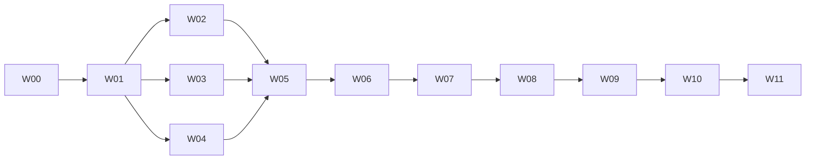

# TemperatureMonitor Granular Implementation Plan

> **For agentic workers:** REQUIRED SUB-SKILL: Use superpowers:subagent-driven-development (recommended) or superpowers:executing-plans to implement this plan task-by-task. Steps use checkbox (`- [ ]`) syntax for tracking.

**Goal:** 将W00～W11拆成可独立测试、提交、审查和交接的执行任务，最终交付目标MacBook Air上的本地原生温度监控App及有条件的正式公证包。

**Architecture:** W00～W11是里程碑边界，W01～W11各自对应一个功能PR；W00为仓库引导例外，按文档基线、可信门禁、规则回读三个PR顺序完成。T00.1～T11.3是独立可审查执行单元。硬件、存储、算法可在W01公共契约合入后并行，W05再完成闭环；UI只消费公开快照/历史接口，实机资格与发布不反向修改未经版本化的契约。

**Tech Stack:** Swift 6、SwiftPM tools 6.0、少量C/IOKit桥接、SwiftUI/AppKit/Charts、系统SQLite3、Swift Testing、XCTest/XCUITest、GitHub Actions。

**Spec:** [01现行需求](01-requirements.md)、[02～13专项设计](02-architecture.md)、[21实施契约](21-implementation-contracts.md)、[22工作包计划](22-agent-implementation-plan.md)。机器可读依赖图见[tasks-v1.json](contracts/tasks-v1.json)。

## Global Constraints

- 只实现132项现行需求；REQ-012/114退役，禁止恢复逐物理核心温度、`core_id`或物理Package保证。
- 首个profile固定`Mac16,13-m4-v1`和12个大小写敏感CPU键；主指标为同批完整Raw集合max后EMA。
- 实时显示走内存；Raw/EMA/聚合/趋势按契约进入有界队列和SQLite，不能用UI最新值代替持久化。
- CPU关键，SSD/Battery可选但必须实现探测、Unavailable原因和有限恢复；HID首版只作诊断。
- 无root、外部监控CLI、App Sandbox例外、风扇写入、自动更新、告警或测试fixture的Release回退。
- 模拟、CI、原型、正式App实机、签名公证五类证据分开；不得相互替代。
- W01～W11每个工作包一个`feature/<功能>` PR；W00按引导顺序使用当前文档PR、`feature/w00-repository-gates`和规则证据PR。每个T任务形成一个可审查变更；涉及仓库配置、合并或实机运行的任务以不可变报告和外部状态回读为完成证据。依赖W必须先merge到main，W02/W03/W04可从同一W01基线并行。
- 每个任务先写能失败的测试，再实现最小行为；任务级测试通过后才commit，W级全套门禁通过后才请求独立审查。

## Review Focus

1. worker超时、停止、睡眠或重发现后的旧generation回复不得进入Raw、队列或快照；由T02.6、T05.3、T06.4测试。
2. `ProcessingEngine`只有在一次性QueueReservation成功入队后才交换算法状态；由T05.1、T05.3、T05.5测试。
3. TTL边界、父层先提交、freelist软限与物理文件硬限不得混淆；由T03.4测试。
4. 来源身份、单位和12成员完整性不能因错误恢复而静默变化；由T02.5、T04.3、T09.2测试。
5. Debug fixture、未签名原型或旧构建不得进入Release验收；由T07.1、T08.2、T10.2测试。

## 执行与交接规则

每个任务严格执行以下微步骤；任务表给出本任务的具体文件、失败测试、命令和产出，不能用相邻任务的结果代替。

1. 从最新依赖分支创建/更新当前W分支，运行`git status --short`确认不覆盖用户改动。
2. 只读任务列出的规范和接口，先新增表中指定的失败测试；运行表中命令，确认实际执行数大于0且因缺失行为失败。
3. 只修改表中列出的生产文件，按21中的公开签名及contracts参数实现最小通过行为。
4. 运行任务命令、`python3 scripts/validate-handoff.py`和受影响的既有测试；检查异常路径及Swift 6并发诊断。
5. 检查`git diff --check`、无占位标记、无未登记依赖、无测试数据Release入口。
6. 代码或文档变更按表中commit message提交；纯外部操作记录目标SHA、命令、API回读和证据URL。在W级PR说明中记录结果与限制。
7. W内最后一个任务运行22规定的W级全套检查、核心覆盖门禁和独立审查，形成`docs/validation/product-software/Wxx/<head-sha>/report.md`后再合并。

任务状态只在实际commit和证据存在后勾选。不能因后续任务顺便覆盖了功能就倒填前置任务通过。

### 路径、测试和需求展开规则

- 表内Core/Runtime/Bridge相对路径均以`Packages/TemperatureCore/Sources/`为根；以`Tests/`开头的路径相对`Packages/TemperatureCore/`，只有文件名的`*Tests.swift`按22中的测试target归位。`App/`、`UITests/`、`scripts/`、`.github/`和`docs/`均相对仓库根。
- 行内给出Swift测试suite时，任务命令为`swift test --package-path Packages/TemperatureCore --filter <Suite>`，并核对实际执行数大于0；UI、App、实机与发布任务执行22中对应W的完整命令块。
- 每个T继承22中所属W列出的REQ和TC，但PR报告只把该T实际实现且有证据的子集标为通过；其余保持pending。公开API、默认值、profile或schema变化必须同时更新01/17/21/contracts及相关测试。
- `product-software/`、`product-hardware/`和`releases/`均位于`docs/validation/`。路径中的`<head>`或`<sha>`必须替换为完整源码提交SHA，禁止写当前时间推断出来的别名。

## PR依赖与并行关系

| 工作包 | 分支建议 | 合入前置 | PR退出条件 |
|---|---|---|---|
| W00 | 当前文档分支→`feature/w00-repository-gates`→规则证据分支 | 无 | PR #4基线、默认分支可信检查和main规则回读依次完成 |
| W01 | `feature/w01-core-contracts` | W00 | 类型/config/Clock及core-tests存在并通过 |
| W02 | `feature/w02-sensor-runtime` | W01 | worker、桥接、来源选择和超时回收测试通过 |
| W03 | `feature/w03-storage` | W01 | schema、幂等、历史和TTL/容量测试通过 |
| W04 | `feature/w04-processing` | W01 | Raw/EMA/派生/聚合/趋势/Gap测试通过 |
| W05 | `feature/w05-orchestration` | W02/W03/W04 | MockSensor→SQLite→history闭环及背压通过 |
| W06 | `feature/w06-lifecycle` | W05 | 故障、日志、单实例、sleep/wake和退出通过 |
| W07 | `feature/w07-native-ui` | W06 | UI黑盒、状态、图表与辅助功能通过 |
| W08 | `feature/w08-app-integration` | W07 | 当前源码App/worker构建、E2E和app-build通过 |
| W09 | `feature/w09-hardware-qualification` | W08 | 目标组合五档、生命周期和73h报告通过 |
| W10 | `feature/w10-release` | W09 | 正式签名、公证及最终配置复测通过；无凭证则生成可审计阻塞边界，发布保持pending |
| W11 | `feature/w11-acceptance` | W10或明确的无凭证边界 | 132项逐条证据、最终审查和合并条件一致 |

## W00：基线与仓库门禁

| 任务 | 依赖 | 文件 | 设计与产出 | 先失败/验证命令 | 交接与commit |
|---|---|---|---|---|---|
| - [ ] T00.1 基线复核 | 无 | 00/11/21/22/23、PR #4、`product-software/W00/<head>/baseline.md` | 核对分支、HEAD、134项映射、open blocking Issue和实际ruleset；新增带时间与SHA的基线记录，不修改历史证据 | `python3 scripts/validate-handoff.py`；`gh pr view 4 --json headRefOid,statusCheckRollup` | 后继取得准确head；`docs: record implementation baseline` |
| - [ ] T00.2 文档检查固定 | T00.1 | `.github/workflows/handoff-docs.yml`、`scripts/validate-handoff.py` | 检查push/PR均产生唯一命名`handoff-docs`；故意破坏fixture时检查必须失败，恢复后通过 | `python3 scripts/validate-handoff.py`；Swift contract typecheck | CI逻辑不可由PR脚本自我放行；`ci: enforce handoff contracts` |
| - [ ] T00.3 合入文档基线 | T00.2 | PR #4、GitHub合并状态、门禁分支基线记录 | 维护者核对PR #4 exact head、现有检查和独立审查后用merge commit合入；确认两个parent和远端分支保留，再从该main建门禁分支 | `gh pr checks 4 --watch`；`gh pr view 4 --json headRefOid,mergeCommit,state` | 默认分支先取得完整规范，避免PR自带特权检查自证；外部合并记录进入T00.4报告 |
| - [ ] T00.4 blocking门禁实现 | T00.3 | `.github/workflows/blocking-issues.yml`、`.github/scripts/{blocking-issues.mjs,blocking-issues.test.mjs}`、`scripts/configure-repository.sh`、`product-software/W00/<head>/gate.md` | 在门禁分支实现分页Issue检查，排除PR；Issue变化重算所有open PR最新head，API错误失败；此时只提交代码和配置脚本，不先把未部署检查设为required | `node --test .github/scripts/blocking-issues.test.mjs`覆盖0/普通/blocking/第二页/关闭/重开/新head/API错误 | 用现有检查审查并merge门禁PR，使workflow先进入默认分支；`ci: add blocking issue gate` |
| - [ ] T00.5 启用规则并回读 | T00.4 | 规则证据PR、`docs/11-git-github-workflow.md`、`product-software/W00/<head>/report.md` | 从默认分支触发可信`blocking-issues`并确认真实open PR head状态；管理员再执行幂等配置，回读ruleset、merge策略、检查名和blocking列表；证据PR本身须通过新规则 | `gh api`回读rulesets/repository；`gh pr checks <evidence-pr> --watch`；核对最终merge commit两个parent | main成为W01唯一基线；`docs: record repository gate state` |

## W01：公共契约、配置与时钟

| 任务 | 依赖 | 文件 | 设计与产出 | 先失败/验证命令 | 交接与commit |
|---|---|---|---|---|---|
| - [ ] T01.1 SwiftPM骨架 | T00.5 | `Packages/TemperatureCore/Package.swift`、空target目录、`Tests/TemperatureCoreTests/ContractTests.swift` | 创建只含现有源文件的Swift 6 package；独立测试模块必须能import库 | `swift test --package-path Packages/TemperatureCore --filter ContractTests`先因模块/类型缺失失败 | 提供后续可编译容器；`build: scaffold temperature core package` |
| - [ ] T01.2 类型与配置加载 | T01.1 | `Models.swift`、`Configuration.swift`、复制的defaults/profile资源、`ConfigurationTests.swift` | 逐字实现api-v1公开值类型和初始化器；严格解码版本、容量、周期、12键/编码，不硬编码回退 | `ContractTests`、`ConfigurationTests`覆盖独立模块构造和坏JSON/缺字段/重复键 | W02～W07只依赖这些类型；`feat: add runtime contracts and configuration` |
| - [ ] T01.3 系统与测试时钟 | T01.2 | `Clock.swift`、`TestSupport/TestClock.swift`、`ClockTests.swift` | `mach_continuous_time`相对父会话基准；整数安全换算；ContinuousClock只睡眠；TestClock支持取消 | `swift test ... --filter ClockTests`覆盖墙钟回拨、并发sleep、取消和纳秒大整数 | 输出跨进程共享基准结构；`feat: add continuous session clock` |
| - [ ] T01.4 核心CI与覆盖基线 | T01.3 | `scripts/check-core-coverage.py`、`.github/workflows/core.yml`、W01报告 | 分母固定Core+SensorRuntime业务Swift，排除测试/UI/C薄桥/worker入口；无匹配测试失败 | 全套`swift test --enable-code-coverage`及人为低于80%的失败fixture | 产生真实`core-tests`检查；`ci: add core test and coverage gate` |

## W02：SensorWorker与来源边界

| 任务 | 依赖 | 文件 | 设计与产出 | 先失败/验证命令 | 交接与commit |
|---|---|---|---|---|---|
| - [ ] T02.1 JSON线协议 | T01.4 | `SensorRuntime/WorkerProtocol.swift`、`Tests/Fixtures/ProtocolWorker/main.swift`、`WorkerProtocolTests.swift` | version/requestID/generation/command严格枚举；1MiB上限；Int64不经Double | 覆盖成功、坏JSON、超长、错version/ID/generation、未知command | T02.2消费编码器/解析器；`feat: define bounded sensor worker protocol` |
| - [ ] T02.2 WorkerClient管道 | T02.1 | `WorkerClient.swift`、`WorkerLifecycleTests.swift` | 绝对路径启动、单请求、持续排空stderr、EOF/退出映射、close幂等 | fixture场景`success/oversize/badJSON/wrongID/oldGeneration/crash` | 暂不接真实硬件；`feat: add sensor worker client` |
| - [ ] T02.3 SMC桥接与解码 | T01.4 | `SensorBridge/{SensorBridge.c,include/SensorBridge.h}`、`SensorDecodingTests.swift`、`Packages/TemperatureCore/THIRD_PARTY_NOTICES.md` | 只读open/keyinfo/read/close；ABI静态断言；flt小端、sp78大端有符号；KeyInfo缓存属generation | 字节向量25.5°C、错长度、未知类型、NaN/Inf和大小写键 | T02.5取得可测试SMC provider；`feat: add read-only smc bridge` |
| - [ ] T02.4 NVMe/Battery/HID选择器 | T02.3 | `SensorBridge/{SensorBridge.c,include/SensorBridge.h}`、`TemperatureCore/Registry.swift`、`SensorDecodingTests.swift`、`SourceRegistryTests.swift` | 唯一Internal NVMe、SMART Kelvin；IOPS CFNumber非Bool优先；HID仅诊断且同名不合并 | SMART0/300K、父树循环/多设备、IOPS缺字段、TB优先级、HID缺事件 | 输出能力原因而非假值；`feat: add optional sensor providers` |
| - [ ] T02.5 Registry与首profile | T02.2/T02.4 | `Registry.swift`、`MetricResolver.swift`、`SourceRegistryTests.swift` | Mac16,13精确12键/format；source UUID+generation；未知机型拒绝；可选缺失保留状态 | 12全/缺1/重复/类型改变、`Tp0b`对`Tp0B`、重发现新身份 | W04取得定义和成员；`feat: add versioned sensor registry` |
| - [ ] T02.6 截止时间与回收 | T02.5 | `WorkerClient.swift`、worker入口、`WorkerLifecycleTests.swift` | read1s/discover10s；TERM250ms后KILL；确认退出才新generation；无法回收即Fatal | 永不回复、晚回复、TERM忽略、KILL后退出、无法确认退出、连续close | W05可安全调度一个worker；`feat: bound sensor worker lifecycle` |

## W03：SQLite、查询与保留

| 任务 | 依赖 | 文件 | 设计与产出 | 先失败/验证命令 | 交接与commit |
|---|---|---|---|---|---|
| - [ ] T03.1 SQLite模块与会话初始化 | T01.4 | `CSQLite/{module.modulemap,shim.h}`、`SQLiteStore.swift`、schema资源、`SQLiteStoreTests.swift` | 系统sqlite3；每连接PRAGMA；SessionMetadata/open/register；schema/quick_check失败Fatal | 临时库验证user_version、FK、views、坏schema和完整metadata | T03.2取得可用事务连接；`feat: initialize session sqlite store` |
| - [ ] T03.2 幂等批次事务 | T03.1 | `SQLiteStore.swift`、`SQLiteStoreTests.swift`、`StorageFaultTests.swift` | canonical hash；BEGIN IMMEDIATE；sources→definitions→segments→数据→receipt；同ID异载荷Fatal | 重复提交、ack丢失、半途中断rollback、主键同值/异值、Gap单调结束 | T05 writer可安全重试原批次；`feat: add idempotent persistence batches` |
| - [ ] T03.3 历史查询和降采样 | T03.2 | `HistoryQuery.swift`、`HistoryQueryTests.swift` | 1h/24h/72h分层；≤8series/2000点；全范围分箱保留min/max；250ms取消 | 8640桶含单峰99、两segment、旧query取消、超限、无数据 | W05/W07取得HistoryResult；`feat: add bounded history queries` |
| - [ ] T03.4 TTL、checkpoint与容量 | T03.3 | `Retention.swift`、`RetentionTests.swift`、`StorageFaultTests.swift` | 父层先提交；查询即时过滤；120s清理宽限；有效页软限/文件硬限；WAL单独限制 | cutoff±1ns、sleep>72h、freelist解除软限、WAL64MiB、磁盘满、清理落后 | W05取得prune/容量信号；`feat: enforce storage retention and capacity` |

## W04：加工算法

| 任务 | 依赖 | 文件 | 设计与产出 | 先失败/验证命令 | 交接与commit |
|---|---|---|---|---|---|
| - [ ] T04.1 校验、身份和Ring Buffer | T01.4 | `Processing/RingBuffer.swift`、`MonitorEngine.swift`、`RingBufferTests.swift`、`ProcessingIdentityTests.swift` | 每series Raw/EMA各8192且300s；有限值；request/sample/generation/elapsed幂等 | NaN/Inf/−274、重复数值、同ID异值、非递增时间、33rd series、覆盖待写禁止 | T04.2取得有序Sample；`feat: add validated bounded sample buffers` |
| - [ ] T04.2 实际dt EMA | T04.1 | `EMA.swift`、`EMAProcessorTests.swift` | `alpha=-expm1(-dt/tau)`；首点Raw；按kind tau；新segment重置 | 80→92.6424111766→97.2932943353、dt≤0、不同tau | T04.3/T04.5复用EMA序列；`feat: add elapsed-time ema processing` |
| - [ ] T04.3 CPU固定集合派生 | T04.2 | `MetricResolver.swift`、`ProcessingIdentityTests.swift` | 同request完整12 Raw max；≤200ms；保存memberSampleIDs；不取各EMA后max | 两批热点换位仍100、缺/重复成员、跨度200ms+1ns、旧批拼接 | 输出`cpu.zone.max` Raw/EMA；`feat: derive cpu zone maximum` |
| - [ ] T04.4 聚合、水位与coverage | T04.3 | `Aggregation.swift`、`AggregationTests.swift` | 半开窗口；Raw→1s→10s→60s；sum/count加权；安全水位；空窗不写0 | 70/71/72/95/74、avg75、边界点、稀疏10s、同秒换段、未完成请求 | T05.3传安全watermark；`feat: add hierarchical raw aggregation` |
| - [ ] T04.5 趋势与Gap状态 | T04.4 | `Trend.swift`、MonitorEngine Gap部分、`TrendTests.swift` | OLS用实际时间；3点/80%；阈值±0.02；Gap后不跨段；连续故障单Gap | rising/stable/falling/insufficient及六种Gap原因、200→1000正常换档 | W05/W07取得趋势/断线；`feat: add segmented trends and gaps` |

## W05：调度、队列与闭环

| 任务 | 依赖 | 文件 | 设计与产出 | 先失败/验证命令 | 交接与commit |
|---|---|---|---|---|---|
| - [ ] T05.1 一次性持久化预留 | T03.2/T04.1 | `PersistenceQueue.swift`、`StorageWriter.swift`、`BackpressureTests.swift` | reserve绑定owner/generation/行/字节；单次consume/cancel；在途计上限；writer仅排空 | 双消费、错owner、实际行超预留、enqueue失败、16384/32MiB、高低水位 | ProcessingEngine可原子“入队后换状态”；`feat: add bounded persistence queue` |
| - [ ] T05.2 三日程采样器 | T02.6/T01.4 | `SamplingService.swift`、`SamplingServiceTests.swift` | 单worker；计划时刻推进；CPU优先；跳过不追赶；改档nextDue重算；可选缺失不排程 | 50ms读120ms、同时到期、中途200→500、stop期间等待 | T05.3取得确定事件流；`feat: add deterministic sampling schedules` |
| - [ ] T05.3 重试与安全watermark编排 | T04.4/T05.1/T05.2 | `MonitorEngine.swift`、`WatermarkTests.swift`、`BackpressureTests.swift` | 先预留再IO；返回先加工再advance；入队ack后同步换状态；旧generation丢弃 | 请求0.95→1.05s、队列拒绝状态不前移、CPU整批重试、迟到回复 | T05.4取得一致内存/持久化状态；`feat: coordinate watermarks and backpressure` |
| - [ ] T05.4 Controller快照和历史路由 | T03.3/T04.5/T05.3 | `MonitorEngine.swift`、`ControllerFixture.swift`、`MonitorIntegrationTests.swift` | start/open/register；≤5Hz bufferingNewest快照；5min内存，其余SQLite；persistedThrough | fixture脚本启动/读/换档/历史/stop；取消旧历史；UI慢消费 | W07只消费MonitorController；`feat: expose monitor controller streams` |
| - [ ] T05.5 软件端到端闭环 | T03.4/T05.4 | `MonitorIntegrationTests.swift`、W05验证报告 | MockSensor→12Raw→max→EMA→aggregate→queue→SQLite→history；注入故障保持恰好一次 | W05四套测试＋全Core覆盖；核对DB与内存样本ID/值/segment | W06获得稳定核心；`test: verify monitoring software data loop` |

## W06：故障、诊断与生命周期

| 任务 | 依赖 | 文件 | 设计与产出 | 先失败/验证命令 | 交接与commit |
|---|---|---|---|---|---|
| - [ ] T06.1 重试与严重性矩阵 | T05.5 | `TemperatureCore/Diagnostics/{MonitorFailure,RetryPolicy}.swift`、`RetryPolicyTests.swift`、`ErrorCoordinatorTests.swift` | 四类预算唯一所有者；CPU/DB/算法关键Fatal；可选Unavailable＋3轮恢复 | 精确attempt/waits、非暂时错误不重试、恢复连续3次、无嵌套预算 | T06.2/T06.4消费稳定错误码；`feat: enforce retry and severity policy` |
| - [ ] T06.2 日志与Fatal报告 | T06.1 | `TemperatureCore/Diagnostics/{DiagnosticLogger,ReportWriter}.swift`、`DiagnosticsTests.swift` | JSONL 5MiB×5、报告1MiB×20、14天；原错误冻结；OSLog/stderr兜底 | 轮转边界、不可写目录、报告二次失败、敏感字段缺失检查 | 输出可复制错误码/报告URL；`feat: add bounded diagnostics reporting` |
| - [ ] T06.3 单实例与安全清理 | T03.4/T06.1 | `TemperatureCore/SessionLock.swift`、`TemperatureCore/Storage/SessionCleanup.swift`、`SessionLifecycleTests.swift` | flock先于清理；仅bundle/session/schema marker目录；拒绝symlink和越界 | 两持有者、恶意路径、无marker、强杀残留、当前库损坏 | T06.4取得安全会话资源；`feat: guard single-session storage cleanup` |
| - [ ] T06.4 sleep/wake/stop/Fatal状态机 | T06.2/T06.3 | `TemperatureCore/MonitorEngine.swift`、`App/SessionCoordinator.swift`、`SessionLifecycleTests.swift` | 幂等stop；sleep终结在途/worker，wake重发现/分段/prune；5s退出；Fatal可见30s | await read时stop、两次stop、墙钟跳变、sleep跨TTL、worker/DB关闭卡住 | W07连接MainActor展示回执；`feat: complete monitor lifecycle state machine` |

## W07：原生界面

| 任务 | 依赖 | 文件 | 设计与产出 | 先失败/验证命令 | 交接与commit |
|---|---|---|---|---|---|
| - [ ] T07.1 Xcode壳、测试fixture和PresentationModel | T06.4 | `TemperatureMonitor.xcodeproj`、`App/TemperatureMonitorApp.swift`、`App/Presentation/PresentationModel.swift`、`UITests/TemperatureMonitorUITests.swift` | Swift6/arm64/15.7.3；Debug/Test才接受4类fixture并显著标注；Release拒绝 | 启动basic/gap/stale/fatal；Release参数被拒；snapshot最多5Hz | 后继视图只绑定PresentationModel；`build: scaffold native app and ui fixtures` |
| - [ ] T07.2 菜单栏与Popover | T07.1 | `App/Presentation/{StatusItemController,TemperaturePopover}.swift`、`UITests/TemperatureMonitorUITests.swift` | AppKit status item/popover；左右键分工；Esc/外点关闭；340×640限高滚动 | `status.temperature`、左/右键、Esc、无值`— °C`、浅深色 | 输出稳定菜单栏入口；`feat: add temperature status popover` |
| - [ ] T07.3 Dashboard、来源与设置 | T07.2 | `App/Presentation/{TemperatureDashboard,TemperatureSourceRow,SettingsView}.swift`、`UITests/TemperatureMonitorUITests.swift` | 主窗960×680/min800×560；分组来源/evidence；五档；关窗不停采；无告警/自启 | `cpu.period`、`source.list`、⌘W/⌘Q、Unavailable/缓存/过期 | T07.4取得选中series/range状态；`feat: add temperature dashboard and settings` |
| - [ ] T07.4 历史图表 | T05.5/T07.3 | `App/Presentation/HistoryChartView.swift`、`Tests/TemperatureCoreTests/HistoryChartModelTests.swift`、`UITests/TemperatureMonitorUITests.swift` | 5min EMA；1h/24h/72h历史；≤8/2000；min/max包络；按segment/Gap断线 | 四范围、峰值95保留、无历史、Gap、多series、隐藏窗口停止绘制 | 输出可验证历史视图；`feat: add segmented temperature history chart` |
| - [ ] T07.5 Fatal、辅助功能和UI门禁 | T06.4/T07.4 | `App/Presentation/FatalView.swift`、`UITests/TemperatureMonitorUITests.swift`、`product-software/W07/<head>/report.md` | 30s从可见回执开始；打开报告/复制/退出；NSAlert兜底；键盘/减少透明度/窄屏 | `fatal.code`/`fatal.quit`、渲染失败、辅助功能标识、完整XCUITest | W08取得可装配UI和截图；`test: complete native ui acceptance` |

## W08：App装配与构建

| 任务 | 依赖 | 文件 | 设计与产出 | 先失败/验证命令 | 交接与commit |
|---|---|---|---|---|---|
| - [ ] T08.1 生产依赖装配与资源 | T07.5 | `App/{TemperatureMonitorApp,AppDelegate}.swift`、`App/Resources/{defaults-v1.json,first-profile-v1.json,Info.plist,ThirdPartyNotices.md}` | 唯一真实SessionCoordinator；资源逐字匹配contracts；Release无fixture/fallback | 资源hash、Bundle ID/target、依赖图和Release参数检查 | T08.2取得当前源码App target；`feat: assemble production temperature app` |
| - [ ] T08.2 worker嵌入与本地包 | T08.1/T02.6 | `scripts/build-app.sh`、`TemperatureMonitor.xcodeproj/project.pbxproj` | set-euo；固定DerivedData；嵌入同构建worker；先worker后App ad-hoc签名；拒绝旧产物 | 删除worker/资源/完整Xcode/新产物分别失败；codesign verify | 输出`build/TemperatureMonitor.app`；`build: package local temperature monitor app` |
| - [ ] T08.3 E2E与app-build CI | T08.2 | `Tests/TemperatureCoreTests/EndToEndTests.swift`、`.github/workflows/app.yml`、`docs/validation/product-software/W08/<head>/report.md` | 12源全链、DB BUSY/背压/Gap/退出清理；CI固定Xcode并保存版本 | Core全套、coverage、build-app、XCUITest、Release无测试开关 | W09只测试该App SHA；`ci: verify production app integration` |

## W09：目标机资格

| 任务 | 依赖 | 文件 | 设计与产出 | 先失败/验证命令 | 交接与commit |
|---|---|---|---|---|---|
| - [ ] T09.1 资格脚本与证据schema | T08.3 | `scripts/{run-hardware-qualification.sh,summarize-product-qualification.py}`、`scripts/tests/test_summarize_product_qualification.py` | 输入App/profile/suite；输出capabilities/timing/samples/summary/report；记录SHA/签名/环境 | 用坏/缺字段fixture使总结器失败；dry-run不调用旧probe | T09.2取得可审计采集入口；`test: add product hardware qualification tools` |
| - [ ] T09.2 来源与五档实机 | T09.1 | 新的`product-hardware/<model-build>/<sha>/`证据 | 确认12键flt4、SSD Internal、Battery选源；五档各≥10min空闲+负载；不推断刷新率 | summary检查skipped≤1%、p95≤period、p99≤2period、显示p95≤500ms | 固定通过组合或blocking Issue；`test: qualify target sensor sources and schedules` |
| - [ ] T09.3 生命周期与负载实机 | T09.2 | `product-hardware/<model-build>/<sha>/{lifecycle,processes,report}.json`、GitHub Issue/回归报告 | 3轮sleep/wake、换档、关窗、退出重启、双实例、断网；停止无孤儿worker | 验证source/definition/segment/Gap/TTL和进程清单 | T09.4取得稳定候选App；`test: qualify target lifecycle behavior` |
| - [ ] T09.4 73小时耐久 | T09.3 | `product-hardware/<model-build>/<sha>/{endurance.csv,summary.json,report.md}`、`docs/13-operations-distribution.md`兼容矩阵 | 连续≥73h越过72h TTL；每小时资源、DB/WAL/log、队列峰值；父层先提交 | 总结器必须对断档、超限、无小时样本或旧SHA失败 | W10只接收此SHA/报告；`test: qualify long-running target build` |

## W10：正式签名与公证

| 任务 | 依赖 | 文件 | 设计与产出 | 先失败/验证命令 | 交接与commit |
|---|---|---|---|---|---|
| - [ ] T10.1 可重复发布脚本 | T09.4 | `scripts/package-release.sh`、`scripts/tests/test-package-release.sh`、`docs/validation/releases/<version>/report.md` | 验证凭证；重建；worker→App签名；ZIP→notary→staple→spctl→最终ZIP；日志不泄密 | 缺证书/profile、notary拒绝、staple失败、旧App、worker签名错均失败 | 有凭证输出notarized ZIP；无凭证明确外部依赖；`build: add notarized release packaging` |
| - [ ] T10.2 正式配置复测或阻塞边界 | T10.1 | `releases/<version>/{manifest,release-blocked}.json`、正式App实机证据、兼容矩阵 | 有凭证时记录App/ZIP SHA、Team、ticket、SDK/profile/licenses并用正式配置重跑来源/五档/生命周期/73h；无凭证时只生成含原因、时间和候选SHA的`release-blocked.json`，发布REQ保持pending | manifest交叉验证SHA和ticket；阻塞文件不得含伪造ticket/签名结论；任何配置变化禁止复用ad-hoc结论 | W11取得“已正式发布”或“本地完成、发布pending”的明确状态；`test: qualify signed release configuration` |

## W11：逐需求验收与最终交付

| 任务 | 依赖 | 文件 | 设计与产出 | 先失败/验证命令 | 交接与commit |
|---|---|---|---|---|---|
| - [ ] T11.1 逐REQ证据绑定 | T10.2 | `docs/contracts/acceptance-v1.json`、`docs/17-traceability.md`、`docs/validation/product-software/W11/<head>/acceptance.md` | 132项逐条绑定实现SHA、TC日志、环境和结果；012/114只retired；无证据保持pending | 扩展validator拒绝空证据、错SHA、用模拟冒充实机、退役项pass | 产出机器可审计验收表；`docs: bind requirement acceptance evidence` |
| - [ ] T11.2 全分支独立审查 | T11.1 | `docs/validation/product-software/W11/<head>/independent-review.md`、GitHub Issues及修复commit | 检查所有权、退出、固定成员、缺口、水位、幂等、路径安全、许可和Release fallback | 全套文档/Core/App/UI/实机/发布门禁；open blocking必须为0 | 得到非实现者审查结论；`docs: record final independent review` |
| - [ ] T11.3 exact-head合并与交付 | T11.2 | W11 PR说明、`docs/validation/product-software/W11/<head>/delivery.md` | 核对最新head五检查、ruleset、blocking、支持矩阵、本地App/ZIP状态；维护者merge commit并保留分支 | `gh pr checks`、rules API、merge commit两个parent、远端分支存在 | 项目状态准确分为本地完成/正式发布完成；`docs: finalize project delivery` |

## 工作包结束检查

每个W的最后一个任务必须同时满足：

- [ ] 该W所有T任务commit均存在，依赖图没有跳过节点，PR只含本W范围。
- [ ] 任务级测试、W级测试、`validate-handoff.py`、`git diff --check`和适用覆盖门禁通过。
- [ ] 公开API、defaults、profile或schema若变化，01/17/21/contracts/测试同时版本化。
- [ ] 审查者可以仅凭PR、验证报告和本文件理解输入、输出、失败边界和下一W的消费接口。
- [ ] 合并使用merge commit，保留远端分支；依赖W未合并前不从旧main开始后续正式PR。

## 当前状态

本文只完成任务拆分，没有实现T00.1以后的产品任务。当前生产App仍未创建；已有证据状态以00和2026-09-18交接验证记录为准。

本次拆分的一致性、依赖图和命令结果见[2026-09-19任务拆分验证](research/2026-09-19-task-breakdown-validation.md)。
